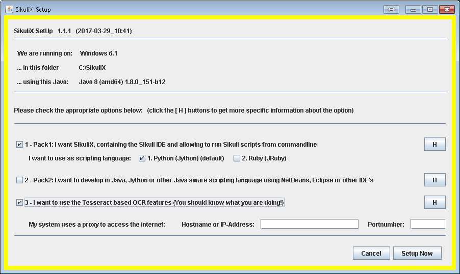
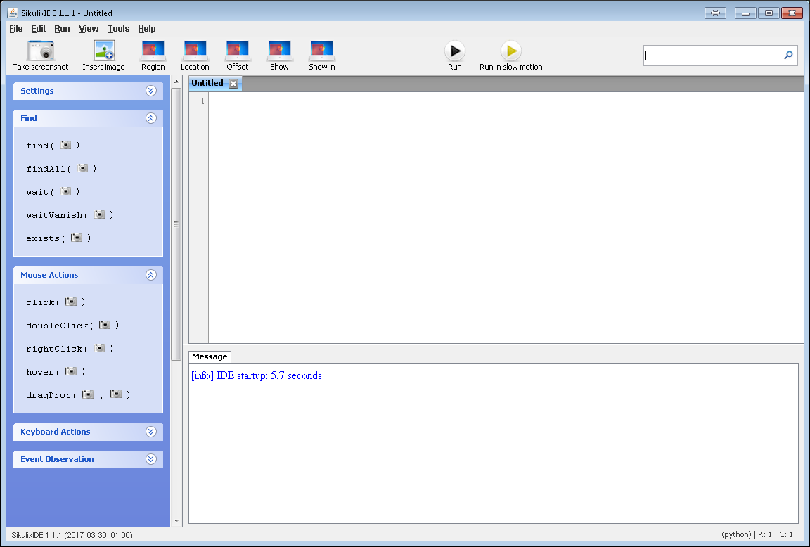
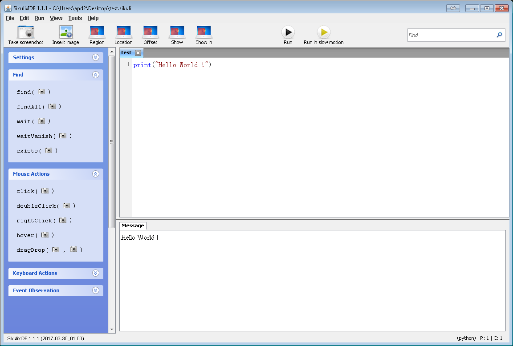

Sikuli Installation
===================

How to properly install SikuliX ?

___

INDEX
-----

1. Pre-requirements
2. Installation
3. Usage
4. Tips

___

Pre-requirements
----------------

#### Java

Sikuli needs Java.

You should install a JDK.

See [this link](http://www.oracle.com/technetwork/java/javase/downloads/jdk8-downloads-2133151.html) to download it, then run installation.

Once Java is installed, you should verify it by opening a command line interface and typing:

    java -version

Then you should see something like:

    java version "1.8.0_151"
    Java(TM) SE Runtime Environment (build 1.8.0_151-b12)
    Java HotSpot(TM) 64-Bit Server VM (build 25.151-b12, mixed mode)

___

#### Python2

Sikuli works with Python2 (2.7.X).

You can install Python2 by visiting [this link](https://www.python.org/downloads/). Just download and install it.

During the installation pay attention to the option "add python to my path". If you missed it, you should add the path to python in your Environment Path variable.

If python is correctly installed you can run

    python

in your command line interface. Resulting in:

    Python 2.7.10 (default, Jul 15 2017, 17:16:57)
    [GCC 4.2.1 Compatible Apple LLVM 9.0.0 (clang-900.0.31)] on darwin
    Type "help", "copyright", "credits" or "license" for more information.
    >>>

This is the python interpreter where you can run python.

____

#### Jython

Jython is a Java runtime for Python. To resume it allows Java imports in Python scripts by associating the JVM to Python.

In order to use Sikuli you should have at least Jython 2.5 but 2.7 is recommended.

Go to [Jython website] then download and install Jython on your computer.

As for Python, don't miss the "add to my path" option. If you missed it, you should add the path to jython in your Environment Path variable.

Once installed, Jython interpreter also can be accessed in command line interface:

    $ jython
    Jython 2.7.0 (default:9987c746f838, Apr 29 2015, 02:25:11)
    [Java HotSpot(TM) 64-Bit Server VM (Oracle Corporation)] on java1.8.0_151
    Type "help", "copyright", "credits" or "license" for more information.
    >>> exit()
    $

___

Installation
------------

Download SikuliX 1.1.1 from [launchpad](https://launchpad.net/sikuli/sikulix/1.1.1).
Run it once you have completed all pre-requirements.

In order to use Python2 for sikuli programming and enable OCR engine, make installation options as below:

Then click Yes in any other panel and wait for the installation to be complete.

___

Usage
-----

In order to run SikuliX, you should have a runsikuli script in the installation path.
Running it will launch the sikuli IDE:

To run Sikuli script you can either:

- Type code in sikuli IDE and click the Run button

e.g:

- Type code with and external text editor and run with command line

    path_to_runsikulix -r path_to_sikuli_script.sikuli

e.g:

    $ C:\SikuliX\runsikulix.cmd -r C:\Users\apd2\Desktop\test.sikuli
    +++ running this Java
    java version "1.8.0_121"
    Java(TM) SE Runtime Environment (build 1.8.0_121-b13)
    Java HotSpot(TM) 64-Bit Server VM (build 25.121-b13, mixed mode)
    +++ trying to run SikuliX
    +++ using: -Xms64M -Xmx512M -Dfile.encoding=UTF-8 -Dsikuli.FromCommandLine -jar C:\SikuliX\sikulix.jar -r C:\Users\apd2\Desktop\test.sikuli
    Hello World !
___

Tips
----

#### Add sikuli pre-requisites and elements to path

###### Windows

###### Mac

###### Linux

___

last update 2/19/2018

:sunglasses:
