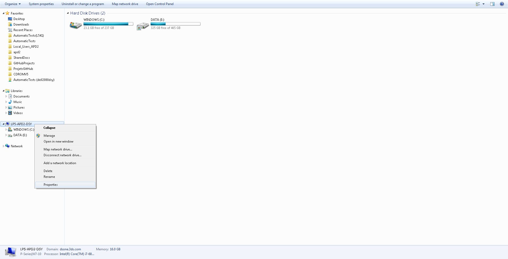
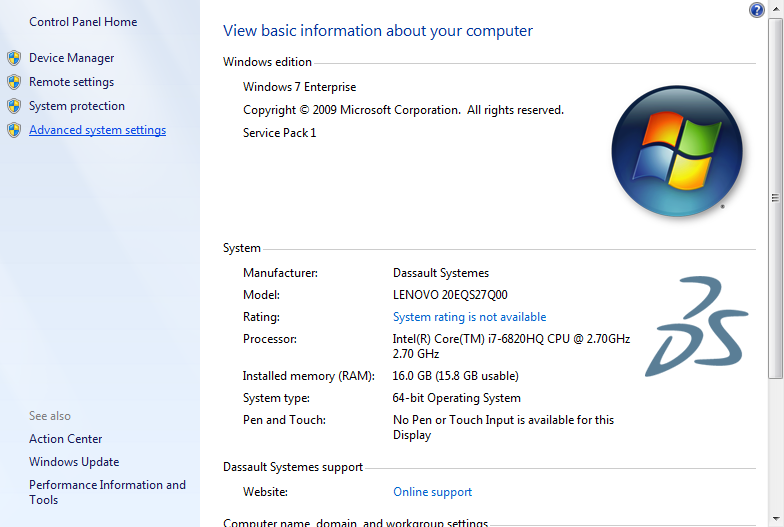
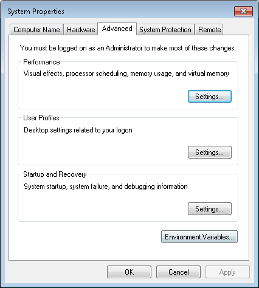
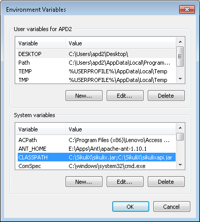
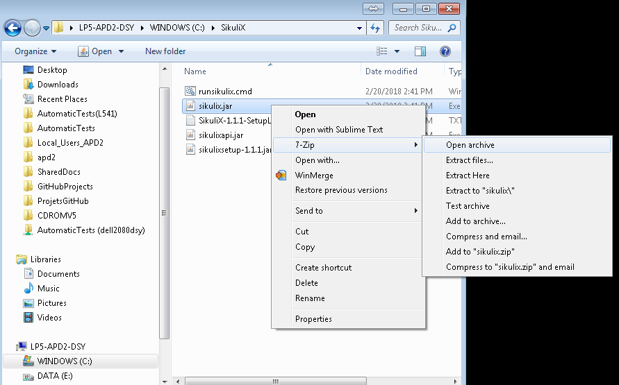
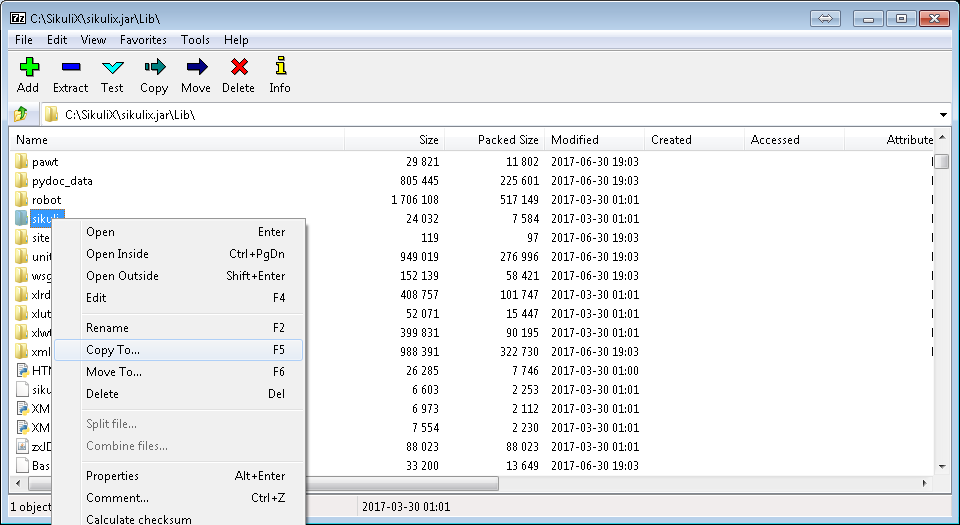
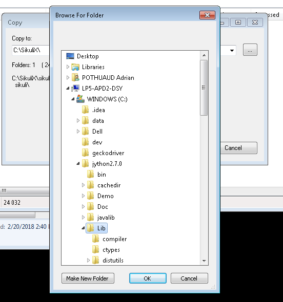

Run SikuliX via Jython interpreter within Python scripts
========================================================

Goals
-----

**SikuliX needs specific architecture disabling us to use cool Python tools**

  e.g: BDD

  myscript.sikuli

  |_______ myscript.py

In order to use things like BDD, or even to be closer to a python package, we can run SikuliX features using the Jython interpreter!

Requirements
------------

- Have Python installed (2.7.X)
- Have Jython installed (2.7.X)
- Have SikuliX installed
- Add sikulix.jar to Java CLASSPATH (Environment Variable)

  e.g: in windows

- Extract sikulix.jar/Lib/sikuli folder in JYTHON_HOME/bin/sikuli

  e.g: in windows

Usage
-----

- Create a python file (e.g: jython/test.py)
- Import sikuli with

    from sikuli import *

- Write your script as in a sikuli module
- Run it with

    path_to_jython/Lib/jython path_to_script/script.py
